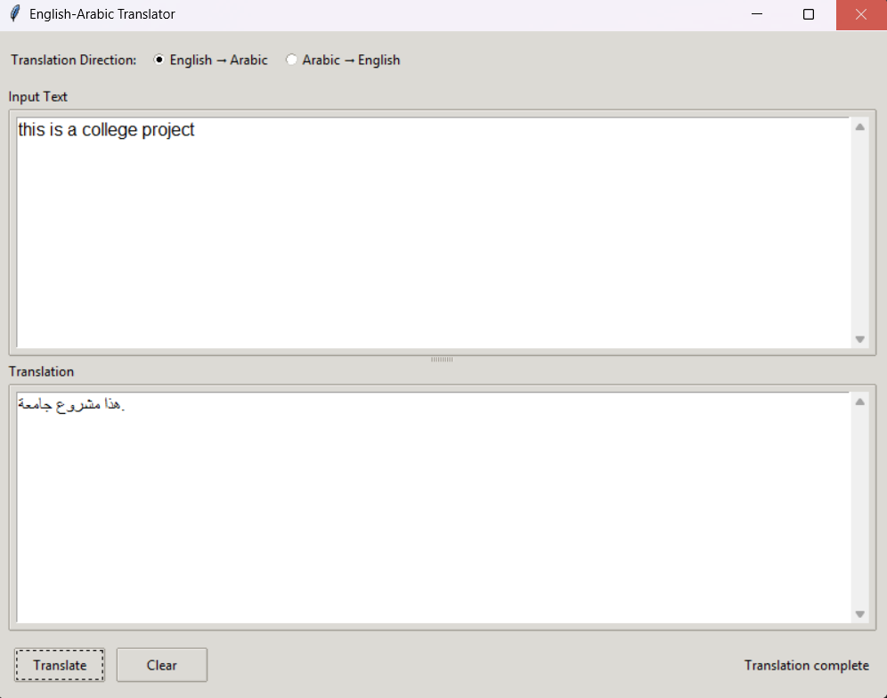
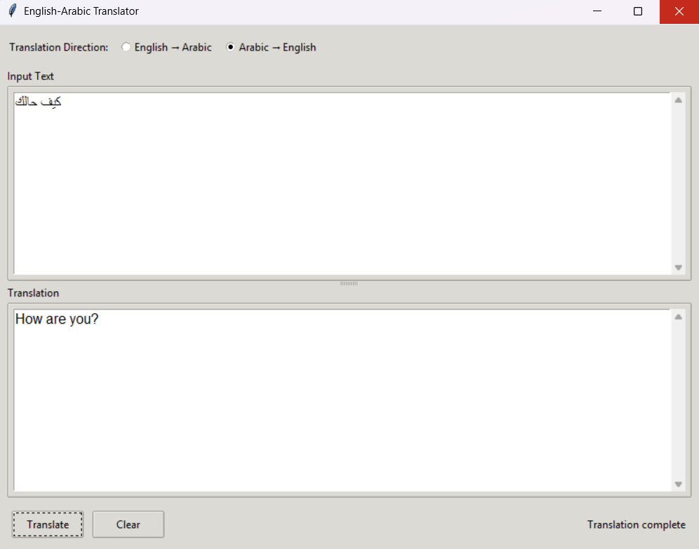

# English-Arabic Bidirectional Translation

This project fine-tunes a pretrained neural machine translation model to translate between English and Arabic in both directions.

## Features
- Supports both English → Arabic and Arabic → English translation
- Fine-tunes the Facebook BART base model with compact task prefixes
- Includes a simple GUI for user interaction
- Evaluates translation quality with BLEU scores
- Optimized for faster training and inference

## Dataset
- Tatoeba (English-Arabic parallel corpus)
- Preprocessing with compact task prefixes ("en2ar:" for Arabic output, "ar2en:" for English output)

## Model
- Based on Facebook's BART base model
- Fine-tuned for bidirectional translation between English and Arabic
- Efficient model with reasonable parameter size
- Performance optimizations for both training and inference
- Supports GPU acceleration with mixed precision

## Project structure
```bash
english-arabic-bidirectional-translation/
│
├── data/
│ ├── Tatoeba.ar-en.ar
│ ├── Tatoeba.ar-en.en
│ └── translation_dataset.tsv
│
├── scripts/
│ ├── prepare_dataset.py
│ ├── finetune_model.py
│ └── evaluate_model.py
│
├── models/
│ └── bart-english-arabic-final/
│
├── results/
│
├── notebooks/
│
├── gui/
│ └── translation_app.py
│
├── docs/
│ ├── quick_start.md
│ └── bart_model.md
│
├── screenshots/
│ ├── english_to_arabic.png
│ └── arabic_to_english.png
│
├── .gitignore
├── LICENSE
├── README.md
└── requirements.txt
```
## How to run
1. Install dependencies:
   ```bash
   pip install -r requirements.txt
   ```

2. Prepare the dataset:
   ```bash
   python scripts/prepare_dataset.py
   ```
   This creates a `translation_dataset.tsv` file containing all translation pairs.

3. Fine-tune the BART model (optimized for faster training):
   ```bash
   python scripts/finetune_model.py
   ```
   The optimized training process:
   - Uses an appropriate training dataset size
   - Runs for 10 epochs with optimized learning rate (5e-5)
   - Uses batch size of 12 for better generalization
   - Implements gradient accumulation for larger effective batch size
   - Adds warmup_ratio and attention_dropout for improved performance
   - Utilizes mixed precision training when GPU is available
   - Saves only the best model to reduce storage usage
   - Demonstrates model capabilities with example translations after training

4. Evaluate the model:
   ```bash
   python scripts/evaluate_model.py
   ```
   The evaluation script:
   - Calculates BLEU scores for both translation directions
   - Generates example translations
   - Works efficiently with a smaller test sample set

5. Launch the GUI application:
   ```bash
   python gui/translation_app.py
   ```
   The GUI features:
   - Simple interface for bidirectional translation
   - Optimized model loading for faster startup
   - Hardware acceleration when available

## GUI Features
- Simple interface for bidirectional translation
- Optimized model loading for faster startup
- Hardware acceleration when available

## Screenshots

### English to Arabic Translation


### Arabic to English Translation


## Performance Optimizations

This project has been optimized for both training and inference performance:

### Training Optimizations
- Using the efficient BART base model for better performance
- Optimized batch size (12) and learning rate (5e-5) for better performance
- Added warmup_ratio (0.1) and attention_dropout (0.15) for improved learning
- Implemented gradient accumulation for effective larger batch sizes
- Added mixed precision (FP16) training when GPU is available
- Trained for 10 epochs with proper warmup for better convergence

### Inference Optimizations
- Model optimized for inference with `model.eval()` mode
- Half-precision (FP16) inference on GPU for faster translation
- Enhanced nucleus sampling with top-k (50) and top-p (0.95) parameters
- Optimized beam search parameters (num_beams=4) for better translation quality

### Memory Optimizations
- Low CPU memory usage mode during model loading
- TorchScript optimization when GPU is available
- Proper memory management with `torch.no_grad()` during inference

## Future Improvements

Based on the evaluation results (BLEU scores of 31.39 for English-to-Arabic and 47.76 for Arabic-to-English), this model performs reasonably well but could be further enhanced with the following techniques:

### Training Enhancements
- Increase training epochs from 10 to 15-20 for better convergence
- Experiment with lower learning rates (2e-5 to 3e-5) for fine-grained improvements
- Adjust attention dropout values (0.1-0.2 range) for better attention learning
- Implement more sophisticated learning rate scheduling

### Data Improvements
- Add domain-specific training examples to address specific translation challenges
- Implement back-translation to generate synthetic training data
- Create focused datasets for problematic translation patterns
- Ensure balanced representation of both translation directions

### Translation Quality
- Fine-tune beam search parameters (experiment with num_beams=5 or 6)
- Adjust top_k and top_p parameters for improved nucleus sampling
- Implement specialized handling for named entities and numbers
- Add post-processing rules for Arabic diacritics and special cases

### GUI Enhancements
- Add copy/paste buttons for translation results
- Implement translation history feature
- Add confidence score display for translations
- Include batch translation capabilities

## Documentation
For more information, see the documentation files in the `docs/` directory:
- [Quick Start Guide](docs/quick_start.md)
- [BART Model Information](docs/bart_model.md)

---

